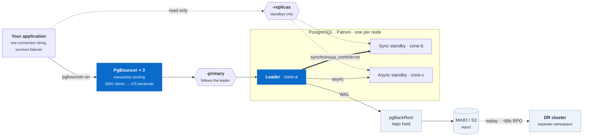

# percona-pg-lab

A working lab for running **PostgreSQL and PgBouncer on Kubernetes** with the
[Percona Operator for PostgreSQL](https://github.com/percona/percona-postgresql-operator) —
covering the whole lifecycle, not just `kubectl apply`.

Every manifest here has been deployed, every claim measured, and every failure
mode in [docs/11-troubleshooting.md](docs/11-troubleshooting.md) actually hit
while building it. Where something does not work, the docs say so.

```bash
make cluster-up        # 4-node kind cluster
make operator-install  # Percona operator v3.0.0, cluster-wide
make ha-up             # 3x PostgreSQL + 3x PgBouncer, synchronous replication
make test              # the bats suite
```

## What you get



Every arrow in that picture is exercised by a test in [`tests/`](tests/), and
every failure mode along it is written up in
[docs/11-troubleshooting.md](docs/11-troubleshooting.md).

---

## Who this is for

**If you are evaluating Percona's operator** — this is a working cluster in
three commands, plus an honest account of what did and did not work in v3.0.0.
Six behaviours documented here are not in the upstream docs, and each one costs
an afternoon to rediscover.

**If you already run PostgreSQL on Kubernetes** — the value is in the parts that
are easy to get subtly wrong: pooler sizing that survives contact with load, an
anti-affinity rule that actually guarantees separation, a DR promotion that does
not silently corrupt the repository you promoted from.

**If you are learning** — every manifest is commented with *why* a value was
chosen and what breaks with the obvious alternative, and every claim has a test
you can run. `make failover` kills the primary and shows you the recovery.

**If something is broken right now** — go straight to
[docs/11-troubleshooting.md](docs/11-troubleshooting.md). It is organised by the
symptom you would see first, because that is what you have when you are
debugging. 27 entries, all of them things that actually happened here.

**What this is not:** a Helm chart to deploy into production, or a replacement
for Percona's documentation. It is a lab you read, run, and break.

---

## What this covers

Start at [docs/00-index.md](docs/00-index.md), or jump straight in:

| Topic | Where |
|---|---|
| Architecture, what the operator actually creates | [docs/01-architecture.md](docs/01-architecture.md) |
| Quickstart from zero | [docs/02-quickstart.md](docs/02-quickstart.md) |
| Standalone / HA / DR topologies and when each is wrong | [docs/03-topologies.md](docs/03-topologies.md) |
| **Connection pooling: sizing, pool modes, what pooling does and does not buy** | [docs/04-connection-pooling.md](docs/04-connection-pooling.md) |
| PostgreSQL tuning through Patroni | [docs/05-postgres-tuning.md](docs/05-postgres-tuning.md) |
| Backup, PITR, and cross-cluster DR | [docs/06-backup-restore-pitr.md](docs/06-backup-restore-pitr.md) |
| Observability: Prometheus, Grafana, exporters, PMM | [docs/07-observability.md](docs/07-observability.md) |
| Extensions and plugins | [docs/08-extensions.md](docs/08-extensions.md) |
| Day-2 operations: scale, upgrade, switchover, pause | [docs/09-lifecycle-operations.md](docs/09-lifecycle-operations.md) |
| Measured performance results | [docs/10-performance-results.md](docs/10-performance-results.md) |
| **Troubleshooting: the failures we actually hit** | [docs/11-troubleshooting.md](docs/11-troubleshooting.md) |
| Driving the lab from an AI agent (MCP) | [docs/12-mcp-server.md](docs/12-mcp-server.md) |
| Running on EKS / GKE / AKS — what changes from kind | [docs/13-cloud-kubernetes.md](docs/13-cloud-kubernetes.md) |
| CI/CD: promoting a database change dev → staging → prod | [docs/14-cicd-promotion.md](docs/14-cicd-promotion.md) |
| **Admission policies: enforcing the rules at the API server** | [docs/15-admission-policies.md](docs/15-admission-policies.md) |
| **Network policy, Pod Security, and the rest of the posture** | [docs/16-network-and-security.md](docs/16-network-and-security.md) |

## Topologies

| Profile | Shape | For |
|---|---|---|
| [`dev-standalone`](clusters/dev-standalone) | 1 PostgreSQL, 1 PgBouncer, local backup repo | Laptop development, CI |
| [`ha`](clusters/ha) | 3 PostgreSQL (one per node, synchronous), 3 PgBouncer, dedicated repo host | Production shape |
| [`dr-standby`](clusters/dr-standby) | Separate cluster replaying WAL from object storage | Cross-region disaster recovery |

## Two results worth knowing before you start

**1. Connection pooling buys you backends, not throughput — and eventually it
buys you staying up at all.**

Measured on this lab, `pgbench -S`, HA profile (`max_connections: 200`,
3 poolers × `default_pool_size: 25`):

| Clients | Duty cycle | Direct | Via PgBouncer |
|---:|---|---|---|
| 60 | idle-heavy (rate-limited) | 60 backends | **15–38 backends**, same tps |
| 100 | idle-heavy | 100 backends | **28 backends**, same tps |
| 40 | saturated | 40 backends | 40 backends, ~3% slower |
| **300** | either | **fails: `max_connections exceeded`** | **serves it**, 74 backends |

Three things fall out of that table:

- At 100% duty cycle every client is always inside a transaction, so there is
  nothing to multiplex and PgBouncer only adds a hop. Benchmarks that test only
  that shape are where "PgBouncer made it slower" comes from.
- With idle clients — what a real application connection pool looks like — the
  backend count collapses by 3–4× at equal throughput.
- At 300 clients the direct connection does not get slower, it **stops working**.
  That is the wall a pooler exists to keep you away from.

Full table, method, and caveats: [docs/10-performance-results.md](docs/10-performance-results.md).

**2. Archive-based DR has an RPO measured in minutes, not milliseconds.**

The standby in [`dr-standby`](clusters/dr-standby) replays WAL from object
storage, so it is always at least one WAL segment behind — measured at ~70s
steady-state here. That is the correct trade for surviving the loss of an entire
region, but it is not streaming replication and should not be documented as
such. See [docs/06-backup-restore-pitr.md](docs/06-backup-restore-pitr.md#rpo).

## Drive it from an AI agent

[`mcp-percona-pg`](https://github.com/dockndevai/mcp-percona-pg) is a companion
MCP server for the same operator. Point it at this lab and an MCP client
(Claude Code, Claude Desktop, Cursor, Codex) can inspect and operate the
clusters here:

```bash
make mcp-config    # ready-to-paste config for every client, read-only, scoped to the lab
```

```
> list the postgres clusters

  ha-cluster (pg-ha) — ready
  postgres  3/3 ready, version 18
  pgbouncer 3/3 ready, pool_mode transaction
```

It drives the operator's custom resources through your kube-config and **never
reads database credentials** — an agent can tell you a cluster is unhealthy
without being able to read a row of your data. It starts read-only, and its
guards are verified against this lab in
[docs/12-mcp-server.md](docs/12-mcp-server.md): tools above your mode are never
registered, destructive operations need separate opt-ins, and `PERCONA_DRY_RUN`
shows you the exact patch it *would* apply.

This lab is the right place to find out what an agent with database access
actually does, because `make down` costs you nothing.

## Requirements

`docker` (8 GiB+ allocated), `kubectl`, `helm` 3, `kind`, and `bats-core` for the
tests. `make preflight` checks all of it and warns about other kind clusters
competing for the same Docker VM.

## Layout

```
clusters/      PerconaPGCluster manifests, one directory per topology
environments/  base + dev/staging/prod overlays for the promotion pipeline
policy/        ValidatingAdmissionPolicies, NetworkPolicies, test fixtures
operator/      operator Helm values
observability/ kube-prometheus-stack values, exporter sidecars, alerts, dashboards
backup/        MinIO (S3 target), pgBackRest repo config, backup/restore samples
extensions/    builtin and custom extension configuration
perf/          pgbench sweep harness and its report generator
tests/         bats suites
scripts/       every make target's implementation
docs/          the guides
```

## Contributing

See [CONTRIBUTING.md](CONTRIBUTING.md). Issues and PRs welcome — especially
"this didn't work on my cluster", which is the most useful kind of report for a
repo like this.

## Licence

Apache-2.0. Not affiliated with or endorsed by Percona.
