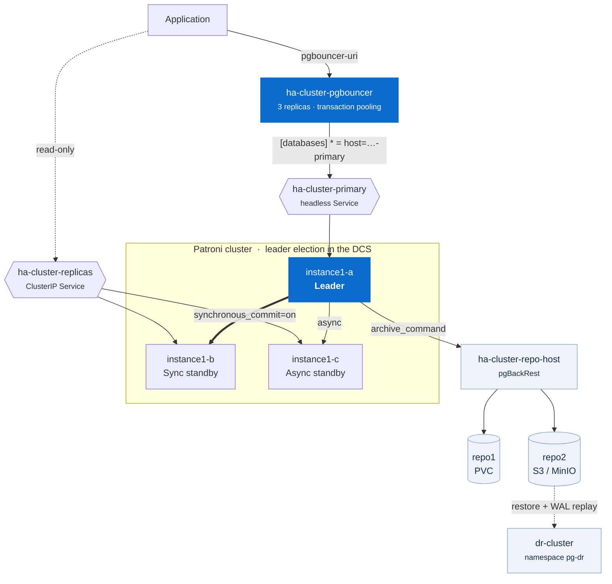

# Architecture

## What the operator actually creates

Applying one `PerconaPGCluster` named `ha-cluster` produces this. Knowing the
names matters — most operational work is addressing one of these directly.

```
Pods
  ha-cluster-instance1-<hash>-0     4 containers: database, replication-cert-copy,
                                                  pgbackrest, pgbackrest-config
  ha-cluster-pgbouncer-<hash>       2 containers: pgbouncer, pgbouncer-config
  ha-cluster-repo-host-0            2 containers: pgbackrest, pgbackrest-config

Services
  ha-cluster-primary       headless    -> the current leader
  ha-cluster-replicas      ClusterIP   -> the standbys only
  ha-cluster-pgbouncer     ClusterIP   -> the poolers
  ha-cluster-ha            ClusterIP   -> Patroni's own endpoint
  ha-cluster-ha-config     headless    -> Patroni's DCS
  ha-cluster-pods          headless    -> every pod, for peer discovery

Secrets
  ha-cluster-pguser-ha-cluster        application credentials
  ha-cluster-pgbouncer                pooler TLS + auth
  ha-cluster-pgbackrest               repo credentials
  ha-cluster-cluster-cert / -ca-cert  internal TLS
  ha-cluster-replication-cert         replication client cert
```

Note that **each instance is its own single-replica StatefulSet**, not one
StatefulSet with three replicas. That is why instance pods are named
`instance1-<hash>-0` and why a killed pod comes back with the identical name —
which in turn is why pod names are useless as a failover signal. Use the
PostgreSQL timeline instead.

## Labels

Every operational selector you will write uses these:

| Label | Values |
|---|---|
| `postgres-operator.crunchydata.com/cluster` | the cluster name |
| `postgres-operator.crunchydata.com/role` | `primary`, `replica`, `pgbouncer` |
| `postgres-operator.crunchydata.com/data` | `postgres`, `pgbackrest` |
| `postgres-operator.crunchydata.com/instance` | `<cluster>-instance1-<hash>` |
| `postgres-operator.crunchydata.com/instance-set` | `instance1` |
| `pgv2.percona.com/version` | operator version |

The role value is **`primary`**, not `master`. Older Crunchy-era documentation
says `master`; that selector matches nothing here and fails silently.

```bash
kubectl -n pg-ha get pods -l postgres-operator.crunchydata.com/role=primary
```

## The connection Secret

```bash
kubectl -n pg-ha get secret ha-cluster-pguser-ha-cluster -o json \
  | jq -r '.data | map_values(@base64d)'
```

| Key | |
|---|---|
| `user`, `password`, `dbname` | credentials |
| `host`, `port` | direct to `<cluster>-primary` |
| `uri`, `jdbc-uri` | direct connection strings |
| `pgbouncer-host`, `pgbouncer-port` | the pooler |
| `pgbouncer-uri`, `pgbouncer-jdbc-uri` | **what applications should use** |
| `verifier` | SCRAM verifier, not a password |

Application configuration should reference `pgbouncer-uri`. It survives failover
without change, because the pooler's `[databases]` entry points at the
`-primary` Service rather than at a pod.

## Layers



Each hop is a decision:

**Applications talk to PgBouncer, not PostgreSQL.** The pooler is the stable
address and the thing that keeps backend count bounded.

**PgBouncer talks to a Service, not a pod.** That is what makes failover
invisible to the connection string.

**Patroni, not the operator, decides who is primary.** The operator manages
Kubernetes objects; leader election happens in Patroni's DCS. When they appear to
disagree, Patroni is the source of truth:

```bash
kubectl -n pg-ha exec <pod> -c database -- \
  patronictl -c /etc/patroni/~postgres-operator_cluster.yaml list
```

**The DR cluster is coupled only through object storage.** No network path to
the primary is required, which is the whole point.

## Operator scope

This lab installs the operator with `watchAllNamespaces: true`, so one operator
manages `pg-dev`, `pg-ha` and `pg-dr`. That is the common platform-team shape and
it is what lets the DR demo span namespaces.

The trade-off is a ClusterRole spanning every namespace. For a single-tenant
install, set `watchAllNamespaces: false` in
[`operator/values.yaml`](../operator/values.yaml) and the operator watches only
its own release namespace.

## Versions

Pinned in one place, [`scripts/lib.sh`](../scripts/lib.sh):

| Component | Version |
|---|---|
| Operator | 3.0.0 |
| PostgreSQL | 18.3 (Percona Distribution `18.3-2`) |
| PgBouncer | 1.25.1 |
| pgBackRest | 2.58.0 |
| Patroni | 4 (the only version operator 3.x supports) |
| Kubernetes | tested on 1.37 (kind) |
