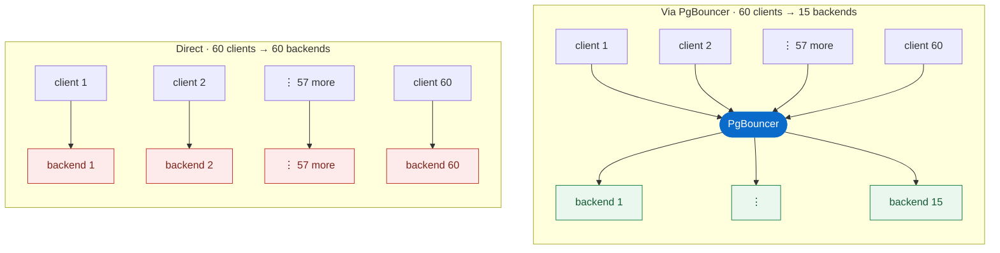
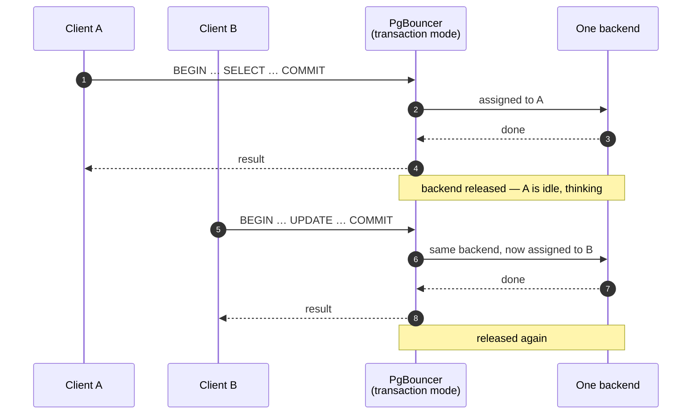
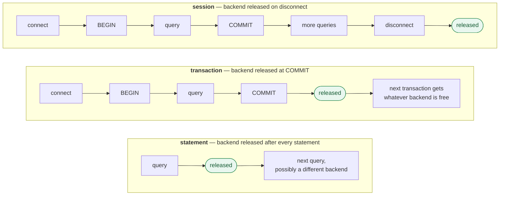
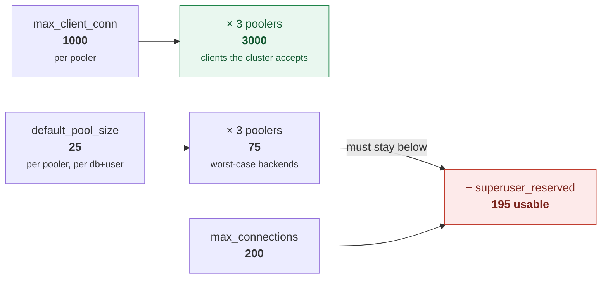
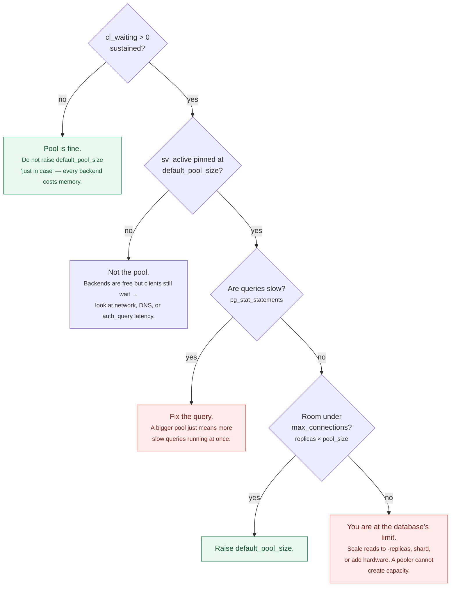
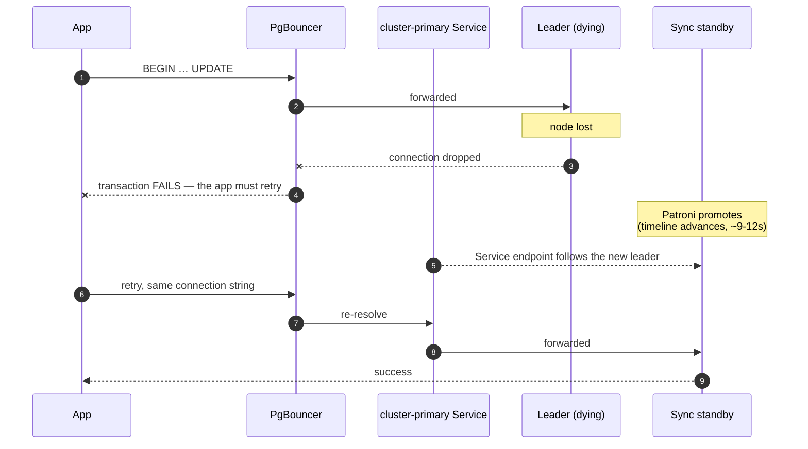

# Connection pooling with PgBouncer

The operator ships PgBouncer as `spec.proxy.pgBouncer`, and it is the entry
point every client should use. This guide covers what it buys you, how to size
it, which pool mode to pick, and how to see inside it.

---

## What pooling actually buys you

Not throughput. Fewer PostgreSQL backends.

### The picture

Without a pooler, a client connection *is* a PostgreSQL backend process. One to
one, for as long as the client stays connected — whether or not it is doing
anything.



The right-hand side is not a smaller number because PgBouncer is clever. It is
smaller because **most clients are idle most of the time**, and a backend is
only held while a transaction is actually running.



That handover is the entire mechanism. Everything else in this guide is about
the conditions under which it works, and what it costs you when it does.

Every PostgreSQL backend is an OS process costing roughly 5–10 MB of private
memory before it does any work, plus a slot in every snapshot the system takes.
Past a few hundred, you pay for them in lock contention and snapshot cost on
*every* query, including the ones from idle connections doing nothing.

PgBouncer lets many client connections share few backends. Crucially, that
sharing only happens **while a client is idle**. Measured on this lab
(`pgbench -S`, HA profile, `max_connections: 200`, 3 poolers ×
`default_pool_size: 25`):

| Clients | Duty cycle | Backends direct | Backends pooled | Throughput |
|---:|---|---:|---:|---|
| 40 | saturated | 40 | 40 | direct ~3% faster |
| 50 | rate-limited | 50 | **19** | equal |
| 60 | rate-limited | 60 | **15–38** | equal |
| 100 | rate-limited | 100 | **28** | equal |
| **300** | either | **connection refused** | **74** | pooled serves it |

Read the first row carefully. With every client permanently inside a
transaction there is nothing to multiplex — PgBouncer needs a backend per busy
client just as a direct connection does, and the only measurable difference is
the extra network hop.

The rate-limited rows are what a real application looks like: a connection pool
of 50–100, most of them idle between requests. Same throughput, a fraction of
the backends.

Note the range on the 60-client row. On an idle machine `pgbench` holds its rate
limit cleanly and 15 backends suffice; under contention the request pattern gets
burstier and more open at once. Both demonstrate multiplexing — but it is worth
knowing that the ratio you get depends on how evenly your traffic arrives, not
just on how many clients you have.

The last row is the one that matters most. At 300 clients the direct connection
does not get slower — it **fails**:

```
FATAL: remaining connection slots are reserved for roles with the SUPERUSER attribute
pgbench: error: could not create connection for client 271
```

PgBouncer served the same 300 clients on 74 backends. That is not an
optimisation, it is the difference between working and not working, and it is
the real reason to deploy a pooler.

> If you benchmark PgBouncer with an unthrottled `pgbench` and conclude it
> "doesn't help", you have measured row one and drawn a conclusion about row
> two.

### Why not just raise `max_connections`?

Because the cost is not the connection limit, it is the backends. Raising
`max_connections` to 5000 does not make 5000 backends affordable; it just
removes the error that was protecting you. The HA profile deliberately keeps
`max_connections: 200` *because* PgBouncer is in front of it.

---

## Pool modes

Set with `spec.proxy.pgBouncer.config.global.pool_mode`.

The three modes differ in exactly one thing: **when the backend goes back into
the pool.**



| Mode | Backend released | Multiplexing | Safe with |
|---|---|---|---|
| `session` | when the client disconnects | none | everything |
| `transaction` | at each `COMMIT`/`ROLLBACK` | **high** | most applications |
| `statement` | after every statement | highest | autocommit only; multi-statement transactions are rejected |

Read down the "released" column and the compatibility table below writes itself:
anything that lives in the connection rather than in the transaction stops being
reliable the moment the backend can change underneath you.


`transaction` is the default in every profile here, and the right answer for
most web applications. What it costs you:

| Feature | `session` | `transaction` |
|---|---|---|
| `SET` / session GUCs outside a transaction | works | **unreliable** |
| `LISTEN` / `NOTIFY` | works | **broken** |
| Session-level advisory locks | works | **broken** |
| `WITH HOLD` cursors | works | **broken** |
| Temporary tables across transactions | works | **broken** |
| `SET LOCAL`, transaction-scoped anything | works | works |
| Protocol-level prepared statements | works | works¹ |

¹ PgBouncer ≥ 1.21 tracks protocol-level prepared statements in transaction
mode. `PREPARE`/`EXECUTE` as *SQL* is still session state and still breaks.

The failure mode is nasty because it is intermittent: your `SET timezone` works
whenever the pooler happens to hand you the same backend, and silently does not
when it does not. Under light load you may never see it. Test at concurrency.

**If you need session semantics**, do not switch the whole cluster to
`session` — that throws away the multiplexing you deployed PgBouncer for. Point
the small number of session-dependent clients at `<cluster>-primary` directly
and leave everything else pooled.

---

## Sizing

Four numbers, and they must be derived in this order.

```
max_client_conn      how many clients may connect to ONE pooler
default_pool_size    backends ONE pooler opens per (database, user)
max_db_connections   ceiling on backends per database, per pooler
max_connections      PostgreSQL's own limit
```

The constraint that matters:



```
pgbouncer_replicas × default_pool_size  <  max_connections − superuser_reserved_connections
```

**Each replica pools independently.** Three poolers with `default_pool_size: 25`
can open 75 backends between them, not 25. This is the single most common sizing
mistake, and it only shows up under load — exactly when you can least afford it.

The `ha` profile:

```
3 poolers × 25 default_pool_size = 75 backends worst case
max_connections 200 − 5 reserved = 195 available
75 < 195 ✓  with room for replication, backups and a human with psql
```

`max_client_conn: 1000` is per pooler, so the cluster accepts up to 3000 client
connections while never exceeding 75 backends. That ratio is the product.

### The other two knobs

`query_wait_timeout: 60` — how long a client waits for a backend before failing.
Without it, a saturated pool becomes an unbounded queue: PostgreSQL looks
perfectly healthy, `pg_stat_statements` shows fast queries, and your users see
timeouts. Set it, and alert on `pgbouncer_pools_client_waiting_connections > 0`.

`server_login_retry: 2` — how long PgBouncer waits before retrying a backend
connection after a failure. The 15s default is a long time to add to a failover
that Patroni finished in 9 seconds.

---

## The admin console

`SHOW POOLS` is how you find out whether your sizing is right. Getting to it
takes three settings that are **not** in Percona's documentation, and the
default install cannot reach it at all.

```yaml
proxy:
  pgBouncer:
    config:
      global:
        admin_users: ha-cluster
        stats_users: ha-cluster
        auth_dbname: ha-cluster     # <- the non-obvious one
```

Two independent things block you otherwise:

1. The operator forces `client_tls_sslmode = require`, so you must connect with
   `sslmode=require`. A default `prefer` negotiation fails confusingly.
2. The operator writes a wildcard `[databases] * = host=<cluster>-primary` entry
   together with a global `auth_user`. Connecting to the reserved `pgbouncer`
   database then makes PgBouncer try to resolve `auth_dbname` to `pgbouncer`
   itself, which it refuses:

   ```
   ERROR cannot use the reserved "pgbouncer" database as an auth_dbname
   FATAL: bouncer config error
   ```

   Setting `auth_dbname` to a real database fixes it.

Then:

```bash
scripts/connect.sh ha --admin -c 'SHOW POOLS;'
```

```
 database   |    user     | cl_active | cl_waiting | sv_active | sv_idle | pool_mode
------------+-------------+-----------+------------+-----------+---------+------------
 ha-cluster | ha-cluster  |        12 |          0 |        12 |       3 | transaction
```

What to look at:

- **`cl_waiting > 0`** — clients queueing for a backend. Either raise
  `default_pool_size`, or find the query holding backends open. This is latency
  your database-side metrics cannot see.
- **`sv_active` at `default_pool_size`** — the pool is the bottleneck.
- **`maxwait`** — longest current wait, in seconds. Should be 0.

`SHOW STATS`, `SHOW SERVERS`, `SHOW CLIENTS` and `SHOW DATABASES` are also
available. The same credentials are what `pgbouncer_exporter` uses — see
[07-observability.md](07-observability.md).

### Is my pool sized correctly?



The trap in that flow is the `DB -->|yes|` branch. Raising `default_pool_size`
makes the waiting *disappear from PgBouncer's view* while making the database
slower, because you have just allowed more concurrent slow queries. The symptom
moves; the problem grows.

---

## Changing pool configuration

PgBouncer config is not a restart. The path is:

```
CR patch → ConfigMap (immediate)
         → file in pod (kubelet sync, 20–60s observed)
         → SIGHUP from the pgbouncer-config sidecar
```

Budget about 90 seconds, and confirm rather than assume:

```bash
scripts/connect.sh ha --admin -c 'SHOW CONFIG;' | grep pool_mode
```

Note the layering. The operator generates `~postgres-operator.ini` containing:

```ini
[pgbouncer]
%include /etc/pgbouncer/pgbouncer.ini   ; your overrides — read FIRST
[pgbouncer]
...operator + spec.config.global...     ; read SECOND, therefore WINS
```

Because the include is evaluated first, you cannot override anything the
operator sets by writing to the included file — only add keys it does not set.
Anything in `spec.proxy.pgBouncer.config.global` is merged into the operator's
own section and does take effect. There is an escape hatch — annotate the
ConfigMap with `pgv2.percona.com/override-config=true` — but then you own the
whole file forever.

---

## Configuring the application side

PgBouncer only solves half the problem. Your framework almost certainly has its
own pool, and the two multiply.


500 client connections is survivable — that is what `max_client_conn` is for —
but it is mostly waste: 500 sockets, 500 TLS sessions, and 500 idle objects your
app is holding open to serve maybe 40 concurrent transactions.

**With a transaction-mode pooler in front, the app-side pool should be small.**
Acquiring a pooled connection is cheap, so the app pool no longer needs to hide
connection setup cost — which is the reason those defaults are large.

| Setting | Without PgBouncer | With PgBouncer (transaction) |
|---|---|---|
| App pool size per replica | 10–20 | **3–5** |
| App pool max lifetime | long | short is fine |
| App idle timeout | long | short — let PgBouncer hold the state |
| Statement/query timeout | required | still required |

Rough starting point: **app replicas × app pool size ≈ 2–3× your actual peak
concurrent transactions**, not your request rate. Then let
`default_pool_size` be the number that bounds the database.

Two framework-specific notes that bite people:

- **Prepared statements.** PgBouncer ≥ 1.21 handles protocol-level prepared
  statements in transaction mode, so most modern drivers are fine. Drivers that
  emit SQL-level `PREPARE`/`EXECUTE` are not. If you use JDBC, keep
  `prepareThreshold` at its default or set it to 0; for `asyncpg`, disable the
  statement cache (`statement_cache_size=0`) unless you have tested otherwise.
- **Startup parameters.** PgBouncer rejects connections that set startup
  parameters it does not know about. The operator already allows
  `extra_float_digits`; if your driver sets others (`options`, `search_path` at
  connect time), add them to `ignore_startup_parameters`.

## Failure modes worth knowing

**Double pooling.** Your application framework almost certainly has its own
connection pool. An app pool of 50 per replica across 10 replicas is 500 client
connections before PgBouncer sees anything. Shrink the app-side pool: with
PgBouncer in transaction mode, connections are cheap to acquire, so the app pool
should be small and the pooler should do the work.

**Health checks that open a connection per probe.** At `periodSeconds: 5` across
many replicas this is a surprising amount of churn. Reuse a connection or probe
something cheaper.

**Assuming PgBouncer load-balances reads.** It does not. The `[databases]` entry
points at `<cluster>-primary`, so everything goes to the primary. For read
scaling, point read-only clients at `<cluster>-replicas`, which is a real
ClusterIP Service over the standbys. Verified in `tests/20_ha.bats`.

**Assuming a pooled connection survives a failover transparently.** It does not;
in-flight transactions fail. What PgBouncer gives you is that the *connection
string* stays valid and the next attempt succeeds.



Two things make that work, and both are configuration you can get wrong:

- PgBouncer's `[databases]` entry points at the `<cluster>-primary` **Service**,
  not at a pod — so the pooler follows the promotion without a config change.
- `server_login_retry: 2` shortens the wait before PgBouncer retries a backend.
  The 15-second default is a long time to bolt onto a failover Patroni finished
  in nine.

Measured in `tests/30_failover.bats`: writes resumed **under a second** after the
promotion. But step 5 in that diagram is real — **your application still needs
retry logic.** No pooler can give you exactly-once semantics across a primary
that vanished mid-transaction.

## Where pooling does *not* help

Worth being explicit, because deploying a pooler against these problems wastes
everyone's afternoon:

| Problem | Does PgBouncer help? |
|---|---|
| Running out of `max_connections` | **Yes** — this is the core use case |
| Thousands of mostly-idle app connections | **Yes** — the multiplexing case |
| Connection setup latency (TLS + auth per request) | **Yes** — backends stay warm |
| Slow queries | No. A slow query holds its backend either way. |
| Read scaling | No. Every pooled connection goes to the primary; use `<cluster>-replicas`. |
| CPU-bound or IO-bound workloads | No — and it adds a hop. |
| Failover transparency for in-flight transactions | No. See above. |
| A single client hammering one connection | No — nothing to multiplex. |

The honest summary: pooling converts *connection* pressure into *queueing*
pressure, which is a much better problem to have because you can see it
(`cl_waiting`) and bound it (`query_wait_timeout`). It does not create capacity.
