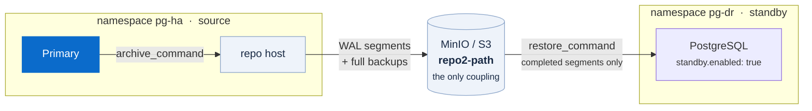
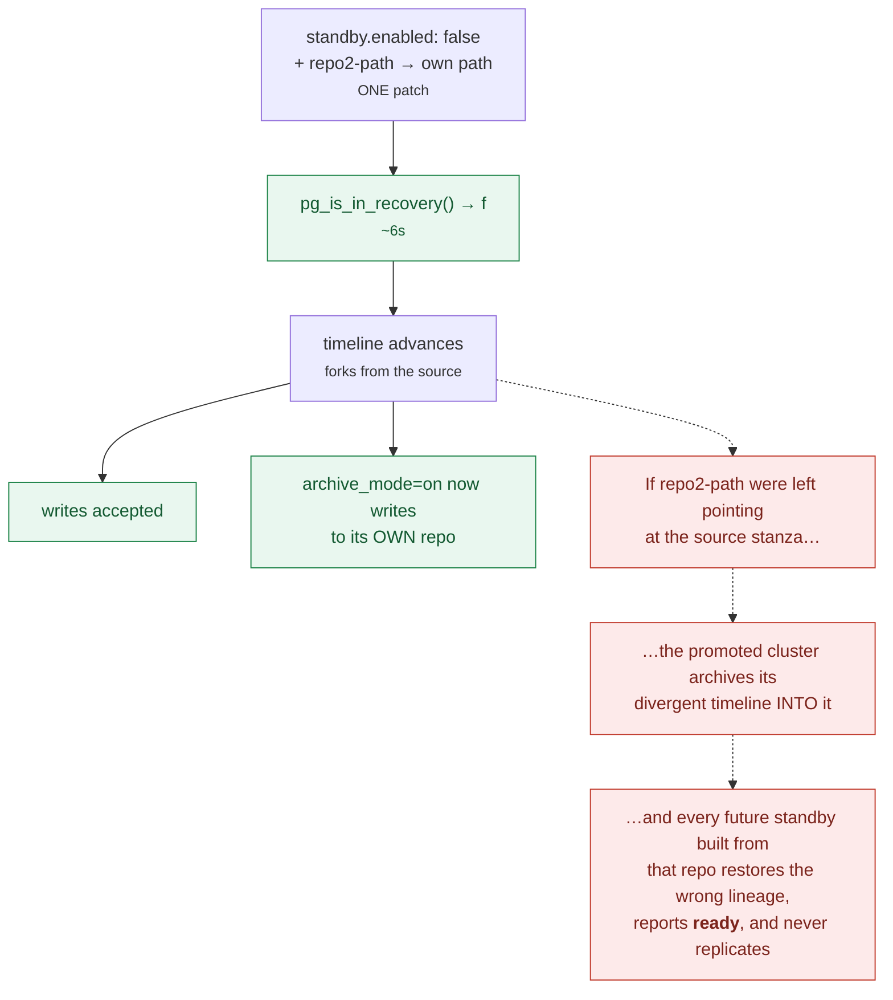

# Backup, point-in-time recovery, and disaster recovery

pgBackRest handles all three. The operator configures it through
`spec.backups.pgbackrest`.

## Repositories

Up to four (`repo1`…`repo4`), each either a PVC or object storage.

```yaml
repos:
  - name: repo1                      # PVC — fast, local, dies with the namespace
    schedules:
      full: "0 1 * * 0"
      differential: "0 1 * * 1-6"
      incremental: "0 */6 * * *"
    volume:
      volumeClaimSpec: {...}
  - name: repo2                      # S3 — slower, survives the cluster
    s3:
      bucket: pgbackrest
      endpoint: minio.pg-backup.svc:9000
      region: us-east-1
```

The distinction matters more than it looks. A PVC repo is fine for "someone
dropped a table". It is worthless for "the namespace is gone" — and it cannot be
read by another cluster, which rules out the DR topology entirely.

**Always set retention.** Without it pgBackRest never expires anything and the
repository fills up silently:

```yaml
global:
  repo1-retention-full: "2"
  repo1-retention-full-type: count
```

If you set `*-retention-full-type` without `*-retention-full`, pgBackRest warns
on every single invocation. Set both.

## MinIO specifics

```yaml
global:
  repo2-s3-uri-style: path          # MinIO. Real AWS S3 wants "host".
  repo2-storage-verify-tls: "n"     # self-signed certificate
```

pgBackRest speaks S3 over **HTTPS only** — there is no plain-HTTP mode, so MinIO
must serve TLS. `scripts/minio-up.sh` generates a self-signed certificate at
deploy time (the private key is never committed).

Credentials go in a Secret whose key ends in `.conf`:

```
[global]
repo2-s3-key=pglabaccess
repo2-s3-key-secret=pglabsecretkey123
```

referenced as `backups.pgbackrest.configuration[].secret`.

## Taking a backup

```bash
make backup                        # full, to repo1
scripts/backup.sh repo2 full       # full, to S3
scripts/backup.sh repo1 incr       # incremental
```

Or declaratively:

```yaml
apiVersion: pgv2.percona.com/v2
kind: PerconaPGBackup
metadata:
  name: manual-repo2
spec:
  pgCluster: ha-cluster
  repoName: repo2
  options: ["--type=full"]
```

Measured here: a 112.8 MB database compresses to 9 MB in the repo and completes
in about 7 seconds.

Inspect the repository directly:

```bash
kubectl -n pg-ha exec sts/ha-cluster-repo-host -c pgbackrest -- \
  pgbackrest --stanza=db --repo=2 info
```

`status: ok` is what you want. `status: error (missing stanza path)` means no
backup exists yet; `(no valid backups)` means the stanza exists but is empty.

## Point-in-time recovery

```yaml
apiVersion: pgv2.percona.com/v2
kind: PerconaPGRestore
metadata:
  name: restore-to-noon
spec:
  pgCluster: ha-cluster
  repoName: repo2
  options:
    - --type=time
    - --target="2026-08-30 12:00:00+00"
```

```bash
make pitr-demo
```

The demo writes a marker row, records the timestamp, writes a second row,
restores to the recorded timestamp, and asserts the second row is gone — proving
the target was honoured rather than just that a restore ran.

A restore is **destructive and in-place**: the cluster is taken down, the data
directory replaced, and PostgreSQL replays WAL to the target. Take a fresh backup
first if the current state might still be wanted.

`--type=time` needs a timezone-qualified timestamp. Without one pgBackRest uses
the server's timezone, which on these images is UTC and probably not what you
meant.

## Disaster recovery

<a id="rpo"></a>

The standby cluster in [`clusters/dr-standby`](../clusters/dr-standby) replays
WAL from `repo2`. It never contacts the primary.



Note what is *absent* from that diagram: any network path from `pg-dr` to
`pg-ha`. That is the property being bought — and the reason the RPO is what it
is.

```bash
make minio-up
scripts/s3-repo-up.sh
make dr-up
```

### The RPO is minutes, not milliseconds

This is archive-based replication. The standby can only replay WAL segments that
have been **completed and archived** — the segment currently being written on the
primary has not been. So the standby is always at least one segment behind.

Measured on this lab: **~70 seconds** from commit to visible on the standby,
after explicitly forcing a segment switch with `pg_switch_wal()`. Without a
forced switch, worst case is bounded by `archive_timeout` or by how long a busy
system takes to fill 16 MB.

`archive-async` is deliberately **not** enabled in this lab. It raises archiving
throughput by batching, at the cost of making any individual segment's latency
unpredictable — and that latency is exactly the RPO. Turn it on for a write-heavy
production cluster; leave it off when you need a legible RPO number.

If you need sub-second RPO, you need streaming replication, which means the
standby must be able to reach the primary — and then it no longer survives losing
the primary's network.

### Two things must match exactly

1. **`repo2-path`** — byte-identical on both clusters. A typo does not error;
   pgBackRest initialises an empty stanza and you get a cluster that reports
   `ready` while holding none of your data.
2. **`postgresVersion`** — WAL cannot be replayed across a major version.

Verify the standby actually restored, rather than trusting `ready`:

```bash
kubectl -n pg-dr exec <standby-pod> -c database -- \
  psql -U postgres -d ha-cluster -tAc \
  "select count(*) from pg_tables where schemaname='ha-cluster';"
```

### The standby must not write to the repository

Give the standby cluster **no `schedules`** on the shared repo. Two clusters
running expiration against one stanza will delete each other's backups.

Also set:

```yaml
patroni:
  createReplicaMethods: [basebackup]
```

Otherwise the operator schedules a `replica-create` backup job that can never
succeed on a standby (`unable to find primary cluster`) and retries forever.

<a id="after-a-promotion"></a>

## Promotion, and the trap in it

```bash
make dr-promote
```

`scripts/dr-promote.sh` sets `standby.enabled: false` **and** repoints
`repo2-path` to the DR cluster's own path, in a single patch.



That second half is the important part, and it is not obvious.

Every PostgreSQL instance runs with `archive_mode=on`. A promoted standby forks
onto a new timeline — and if it still has the source cluster's `repo2-path`, it
begins archiving its own WAL into the shared stanza. The repository then contains
two divergent lineages:

```
wal archive min/max (18): 000000060000000000000012/00000008000000000000001D
                          ^^^^^^^^ primary        ^^^^^^^^ promoted standby
```

The next standby you build from that repository restores the *promoted* cluster's
timeline and waits forever for WAL the real primary will never produce, while
reporting `state: ready` the entire time. We hit this exactly. See
[11-troubleshooting.md](11-troubleshooting.md#poisoned-stanza-a-standby-restores-reports-ready-and-never-replicates).

Note that giving the standby an *additional* local repo does not help:
`archive-push` writes to every configured repository.

To recover a repository that is already poisoned:

```bash
scripts/dr-repo-clean.sh
```

It empties the bucket, re-runs `stanza-create` (a repo-host restart is **not**
enough — the operator only creates the stanza at cluster-creation time), and
takes a fresh full backup from the true primary.

### After promoting

Promotion is one-way. The promoted cluster is on its own timeline and cannot
replay from the old repository again.

1. Take a full backup — its new repository has no base backup yet.
2. Repoint applications at `dr-cluster-pgbouncer.pg-dr.svc`.
3. Scale it up. The DR profile runs a single instance, so it has no HA.
4. The old cluster is not a standby of the new one. Re-establishing replication
   in the other direction means rebuilding from a fresh backup.

Measured: `pg_is_in_recovery()` flips in **6 seconds**, timeline advances by one,
writes are accepted immediately.
