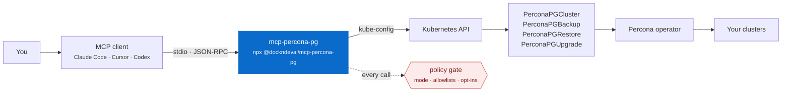
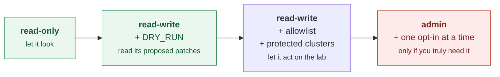

# Driving the lab from an AI agent (MCP)

[`mcp-percona-pg`](https://github.com/dockndevai/mcp-percona-pg) is a Model
Context Protocol server for the same operator this lab deploys. It lets an
MCP-capable client — Claude Code, Claude Desktop, Cursor, Codex — read and
operate `PerconaPGCluster` resources through your kube-config.

The two repositories are complements: this one is the cluster and the reasoning,
that one is the interface. Point the server at `kind-pg-lab` and you have a
completely disposable environment in which to find out what an agent with
database access actually does.



It talks to the **operator's API**, not to PostgreSQL. It never reads or returns
database credentials — so an agent can tell you a cluster is unhealthy without
being able to read a single row of your data.

---

## Point it at this lab

With the lab running (`make ha-up`), the useful configuration is: the
`kind-pg-lab` context, the lab's namespaces, and **read-only**.

```bash
make mcp-config          # prints ready-to-paste config for every client
```

Claude Code:

```bash
claude mcp add percona-pg-lab \
  -e PERCONA_MODE=read-only \
  -e PERCONA_CONTEXT=kind-pg-lab \
  -e PERCONA_NAMESPACE=pg-ha \
  -e PERCONA_NAMESPACE_ALLOWLIST=pg-ha,pg-dev,pg-dr \
  -- npx -y @dockndevai/mcp-percona-pg
```

Claude Desktop / Cursor / Windsurf:

```json
{
  "mcpServers": {
    "percona-pg-lab": {
      "command": "npx",
      "args": ["-y", "@dockndevai/mcp-percona-pg"],
      "env": {
        "PERCONA_MODE": "read-only",
        "PERCONA_CONTEXT": "kind-pg-lab",
        "PERCONA_NAMESPACE": "pg-ha",
        "PERCONA_NAMESPACE_ALLOWLIST": "pg-ha,pg-dev,pg-dr"
      }
    }
  }
}
```

`PERCONA_CONTEXT` matters more than it looks. Without it the server follows your
**current** kube-context, which is exactly the failure mode you do not want: you
switch context to debug production, and the agent quietly follows.

---

## The security model, verified

The claims below were checked against this lab's live cluster, not read off the
README.

**Tools are not registered above your mode.** An over-privileged tool is not
merely refused — the client never sees it, so the model cannot try:

| `PERCONA_MODE` | Tools registered |
|---|---:|
| `read-only` *(default)* | 9 |
| `read-write` | 15 |
| `admin` | 20 |

```
read-only   list_contexts, list_clusters, get_cluster, get_cluster_status,
            get_connection_info, get_pgbouncer_config, get_pg_parameters,
            list_backups, list_restores
read-write  + scale_cluster, set_pgbouncer_config, set_pg_parameters,
            pause_cluster, toggle_builtin_extension, create_backup
admin       + restore_cluster, promote_standby, upgrade_cluster,
            delete_backup, delete_cluster
```

**Admin mode registers the destructive tools but does not enable them.** This
distinction is worth internalising: in `admin`, `restore_cluster` *appears* in
the tool list, and is refused at call time unless separately opted in.

```
Policy denied: Operation 'restore_cluster' is disabled.
Set PERCONA_ALLOW_RESTORE=true to enable restores/PITR.
```

…accompanied by a structured audit line on stderr:

```json
{"ts":"2026-08-30T15:43:09.577Z","audit":"percona-pg-mcp","decision":"DENY",
 "tool":"restore_cluster","capability":"admin","namespace":"pg-ha",
 "cluster":"ha-cluster","reason":"restore not enabled"}
```

So the model may *attempt* a restore and be stopped. If you would rather it
could not form the intention, do not run in `admin`.

**Protected clusters are readable but immutable.**

```
PERCONA_PROTECTED_CLUSTERS=ha-cluster
→ Policy denied: Cluster 'ha-cluster' is protected
  (PERCONA_PROTECTED_CLUSTERS); mutations are refused.
```

**Allowlists are enforced per call, not just at startup.**

```
PERCONA_NAMESPACE_ALLOWLIST=pg-dev
→ Policy denied: Namespace 'pg-ha' is not in the allowlist
  (PERCONA_NAMESPACE_ALLOWLIST).
```

**Dry-run shows you the exact patch and sends nothing.** Verified: the CR still
reported 3 pgBouncer replicas afterwards.

```
PERCONA_DRY_RUN=true
→ [dry-run] Would patch pg-ha/ha-cluster:
  {"spec":{"proxy":{"pgBouncer":{"replicas":2}}}}
```

That last one is the most useful setting in the whole list. Run an agent in
`read-write` + `PERCONA_DRY_RUN=true` for a while and read the patches it
proposes before you ever let it apply one.

### A sensible progression



**Do not point `admin` mode at a cluster you care about.** Use this lab, which
is designed to be destroyed (`make down`).

---

## What it is good for

The tools map onto the topics in these docs, which is what makes the pairing
useful — you can ask about a thing and then go read why it behaves that way.

| Ask | Tool | Background |
|---|---|---|
| *"Show me the status of ha-cluster."* | `get_cluster_status` | [01-architecture](01-architecture.md) |
| *"What pool_mode is it using, and how big is the pool?"* | `get_pgbouncer_config` | [04-connection-pooling](04-connection-pooling.md) |
| *"What's shared_buffers set to?"* | `get_pg_parameters` | [05-postgres-tuning](05-postgres-tuning.md) |
| *"Which backups exist, and how old is the newest?"* | `list_backups` | [06-backup-restore-pitr](06-backup-restore-pitr.md) |
| *"Set pool_mode to session on dev-cluster."* | `set_pgbouncer_config` | needs `read-write` |
| *"Take a full backup to repo1."* | `create_backup` | needs `read-write` |

A worked example against this lab, in read-only mode:

```
> list the postgres clusters

  ha-cluster (pg-ha) — ready
  postgres  3/3 ready, version 18
  pgbouncer 3/3 ready, pool_mode transaction
  crVersion 3.0.0, standby false, host ha-cluster-pgbouncer.pg-ha.svc
```

## What it is not good for

- **Running SQL.** It talks to the Kubernetes API, not to PostgreSQL. For
  queries, use `scripts/connect.sh`.
- **Reading credentials.** By design. Use `kubectl get secret`.
- **Replacing the runbook.** It can promote a standby; it does not know that a
  promoted standby must be detached from the source repository, which is the
  part that will hurt you —
  [11-troubleshooting](11-troubleshooting.md#poisoned-stanza-a-standby-restores-reports-ready-and-never-replicates).

That last point generalises. An agent with these tools can perform every
operation in this repository. It has no idea which of them are one-way doors.
You still need to.

---

## Troubleshooting

**No clusters returned.** The server is almost certainly on a different context.
Set `PERCONA_CONTEXT=kind-pg-lab` explicitly and check
`kubectl config current-context`.

**"Namespace is not in the allowlist".** Working as intended. The lab uses
`pg-ha`, `pg-dev`, `pg-dr` — the CRs are namespaced, so the allowlist must
include the one you are asking about.

**A write "succeeds" but nothing changes.** Check whether `PERCONA_DRY_RUN` is
still set. The response says `[dry-run]`, which is easy to skim past.

**The tool you want is not in the list.** Tools are registered by mode, so a
missing tool means the mode is lower than you think. Restart the client after
changing the environment — MCP servers are launched once per session.
