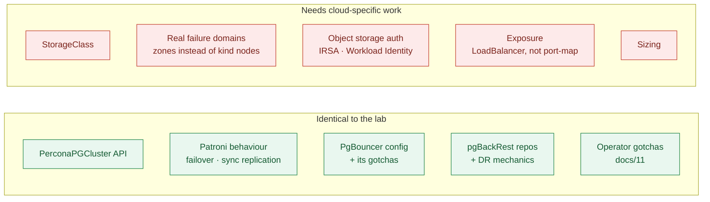

# Running this on a cloud Kubernetes cluster

[02-quickstart](02-quickstart.md) gets you running on kind. This page is about
what changes on EKS, GKE and AKS.

> ### ⚠️ Verification status — read this first
>
> The rest of this repository follows one rule: nothing is documented as working
> unless it was observed working. **This page is the exception, and it is
> flagged rather than quietly mixed in.**
>
> The lab was built and verified on kind. I do not have EKS, GKE or AKS clusters
> to test against, so the provider-specific material here is reasoned from the
> operator's CRD (which *is* verified — every field below exists in
> `pgv2.percona.com/v2` v3.0.0) plus provider documentation. Treat it as a
> well-informed starting point that still needs your own verification, not as
> measured fact.
>
> Where something *was* verified on the lab and carries over unchanged, it says
> so explicitly.

---

## What actually changes

Less than you might expect. The `PerconaPGCluster` API is identical — the same
`instances`, `proxy.pgBouncer`, `patroni.dynamicConfiguration` and
`backups.pgbackrest` you have already been editing.



Everything in [11-troubleshooting](11-troubleshooting.md) applies unchanged. The
reserved `monitor` username, the single-library `shared_preload_libraries`, the
inert `spec.patroni.switchover`, the duplicate topology-spread constraint that
stops reconciliation dead — none of those are kind artifacts. They are operator
behaviour, and they will meet you on EKS exactly as they did here.

---

## Storage

The single most consequential difference. kind's `standard` class is
`rancher.io/local-path`: node-local, no expansion, `Delete` reclaim. A cloud
StorageClass for a database needs three properties the defaults often lack.

```yaml
apiVersion: storage.k8s.io/v1
kind: StorageClass
metadata:
  name: postgres-ssd
provisioner: ebs.csi.aws.com          # pd.csi.storage.gke.io | disk.csi.azure.com
parameters:
  type: gp3                           # pd-balanced | Premium_LRS
  # gp3 decouples IOPS from size — on gp2 you buy IOPS by over-provisioning GB.
  iops: "6000"
  throughput: "250"
  encrypted: "true"
volumeBindingMode: WaitForFirstConsumer
allowVolumeExpansion: true
reclaimPolicy: Retain
```

**`volumeBindingMode: WaitForFirstConsumer`** — provision the volume only once
the pod is scheduled, so the disk is created in the zone the pod landed in.
Without it you get volumes in `eu-west-1a` and pods pending in `eu-west-1b`.

**`allowVolumeExpansion: true`** — you will need to grow the volume, and you
cannot add this retroactively to bound PVCs. kind's local-path has it `false`,
which is why PVC resize does nothing in the lab.

**`reclaimPolicy: Retain`** — the default `Delete` destroys the underlying disk
when the PVC goes. Correct for a cache; catastrophic for a database. It also
means you clean up manually, which is the trade.

| | EKS | GKE | AKS |
|---|---|---|---|
| Provisioner | `ebs.csi.aws.com` | `pd.csi.storage.gke.io` | `disk.csi.azure.com` |
| Type | `gp3` | `pd-balanced` / `pd-ssd` | `Premium_LRS` |
| Driver install | EBS CSI **add-on** — not on by default | built in | built in |
| Built-in class to avoid | `gp2` (default, `Delete`) | `standard` (HDD) | `default` (HDD) |

On EKS the EBS CSI driver is an add-on you must install *and* give an IAM role.
A cluster without it accepts your PVCs and leaves them `Pending` forever.

---

## Failure domains

In the lab, `topology.kubernetes.io/zone` was a label I invented on kind nodes.
On a cloud provider it is real, and the anti-affinity in
[`clusters/ha`](../clusters/ha/cluster.yaml) starts buying you something
material.

Keep the `requiredDuringSchedulingIgnoredDuringExecution` anti-affinity on
`kubernetes.io/hostname`. Then let the operator handle zones — and this is the
important part:

> **Do not add your own `topologySpreadConstraint` for
> `topology.kubernetes.io/zone` with `whenUnsatisfiable: ScheduleAnyway`.**
> The operator already injects one, server-side apply keys the list by
> `(topologyKey, whenUnsatisfiable)`, and a duplicate makes reconciliation fail
> with zero pods, zero events, and an error visible only in the operator log.
> Verified on the lab; see
> [11-troubleshooting](11-troubleshooting.md#duplicate-topologyspreadconstraints-stop-reconciliation-dead).

A three-zone regional cluster with a three-instance cluster is the natural fit:
one instance per zone, `synchronous_node_count: 1`, and a commit that survives
losing a zone.

Note the cost, because it is real and it is not in the operator's control:
synchronous replication across zones pays inter-zone latency on **every
commit** — typically ~1ms within a region, versus microseconds within a zone.
Measure it before assuming it is free. Cross-*region* synchronous replication is
almost never the right answer; that is what the DR topology in
[06-backup-restore-pitr](06-backup-restore-pitr.md) is for.

---

## Object storage for backups

The CR shape is verified against the v3.0.0 CRD — these are the only fields each
provider block accepts:

```yaml
# s3    — required: bucket, endpoint, region
# gcs   — required: bucket
# azure — required: container
backups:
  pgbackrest:
    repos:
      - name: repo1
        volume: {...}                 # keep a local repo for fast restores
      - name: repo2
        s3:
          bucket: prod-pg-backups
          endpoint: s3.eu-west-1.amazonaws.com
          region: eu-west-1
        schedules:
          full: "0 1 * * 0"
          incremental: "0 */4 * * *"
    global:
      repo2-retention-full: "8"
      repo2-retention-full-type: count
      # AWS S3 wants host-style. Only set `path` for MinIO and similar.
      repo2-s3-uri-style: host
```

Keep **both** a PVC repo and an object-store repo. repo1 restores fast; repo2 is
the one that still exists when the namespace does not.

**Verified on the lab and carries over:** the credential mechanism.
`backups.pgbackrest.configuration[].secret` projects files into pgBackRest's
config directory, and the key must end in `.conf`:

```
[global]
repo2-s3-key=AKIA...
repo2-s3-key-secret=...
```

**Better on a cloud provider: do not use static keys at all.** Attach the
identity to the pgBackRest service account and let pgBackRest use the
environment:

- **EKS** — IRSA, or EKS Pod Identity. Annotate the service account with
  `eks.amazonaws.com/role-arn` and grant the role `s3:GetObject`, `PutObject`,
  `DeleteObject`, `ListBucket` on that bucket only.
- **GKE** — Workload Identity, via `iam.gke.io/gcp-service-account`.
- **AKS** — Azure Workload Identity, via `azure.workload.identity/client-id`.

*Not verified here* — the lab used MinIO with static keys because that is what
runs on a laptop. Confirm the exact annotation and service-account name against
Percona's per-provider documentation before relying on it.

Two things that **were** verified and will bite you on any provider:

- pgBackRest speaks S3 **over HTTPS only**. There is no plain-HTTP mode.
- `repo2-path` must be byte-identical between a primary and its DR standby. A
  typo does not error — it initialises an empty stanza, and you get a standby
  that reports `ready` holding none of your data.

---

## Exposure

kind used host port mappings. On a cloud provider, `spec.proxy.pgBouncer.expose`
creates a real load balancer:

```yaml
proxy:
  pgBouncer:
    expose:
      type: LoadBalancer
      annotations:
        service.beta.kubernetes.io/aws-load-balancer-type: nlb
        service.beta.kubernetes.io/aws-load-balancer-scheme: internal
      loadBalancerSourceRanges:
        - 10.0.0.0/8
```

`internal`, and a source range. A PostgreSQL pooler on a public load balancer is
a bad afternoon waiting to happen — and the operator will do exactly what you
asked without comment.

If nothing outside the cluster needs to connect, do not set `expose` at all. The
`ClusterIP` Service is enough, and in-cluster is where your application lives.

---

## Sizing

The lab runs `250m` CPU / `512Mi` per instance so three fit on a laptop. Those
numbers are wrong everywhere else.

Two rules worth carrying over from [05-postgres-tuning](05-postgres-tuning.md):

**Size PostgreSQL against the container limit, not the node.** `shared_buffers`
at ~25% of the *limit*; `effective_cache_size` near the limit. A pod with a 16Gi
limit on a 64Gi node has 16Gi.

**Set requests equal to limits for PostgreSQL.** It gives the pods
`Guaranteed` QoS, which means they are evicted last under node pressure. The
alternative is a database that gets evicted to protect a stateless workload.

```yaml
resources:
  requests: {cpu: "2", memory: 8Gi}
  limits:   {cpu: "4", memory: 16Gi}
```

Note that `requests: cpu 2 / limits: cpu 4` is *not* Guaranteed — for that,
requests must equal limits on both. Decide deliberately which you want: burstable
CPU with eviction risk, or guaranteed placement with a hard ceiling. For a
primary carrying synchronous commits, guaranteed is usually right.

Also worth having on a cloud cluster, and absent from the lab because kind has
no pressure to speak of:

```yaml
proxy:
  pgBouncer:
    minAvailable: 2        # PodDisruptionBudget — survive a node drain
```

and a `priorityClassName` above your stateless workloads, so a cluster autoscaler
under pressure does not evict the database first.

---

## A realistic first run

1. Cluster with three node groups, one per zone. Managed control plane.
2. CSI driver installed and, on EKS, given its IAM role.
3. `postgres-ssd` StorageClass as above.
4. Operator via Helm, `watchAllNamespaces: false` unless you need otherwise —
   the lab uses cluster-wide to span namespaces, which is more privilege than a
   single-tenant install needs.
5. Deploy [`environments/dev`](../environments/dev) with the StorageClass
   patched in, and confirm `.status.state` reaches `ready`.
6. Run the suite: `scripts/run-tests.sh 00_operator.bats 20_ha.bats`.
7. Attach an object-store repo and take a backup **before** you need one.
8. Force a failover — `--force --grace-period=0`, not a plain delete — and
   measure it on *your* infrastructure. The lab measured 9–12 seconds to
   timeline advance; yours will differ, and the number you have not measured is
   not a number you have.

Then [14-cicd-promotion](14-cicd-promotion.md) for getting changes from that
cluster to the next one.

---

## Managed PostgreSQL instead?

Worth asking honestly. RDS, Cloud SQL and Azure Database remove most of this
page. The operator earns its place when you want:

- the same PostgreSQL across clouds and on-prem, with one control plane
- extensions or configuration a managed service does not expose
- backups in storage you control, with pgBackRest's PITR semantics
- your database in the same declarative pipeline as everything else

If none of those apply, a managed service is a reasonable answer, and this lab
is still a good way to understand what it is doing for you.
