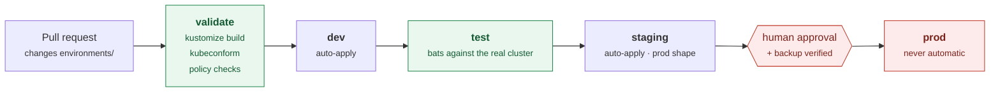
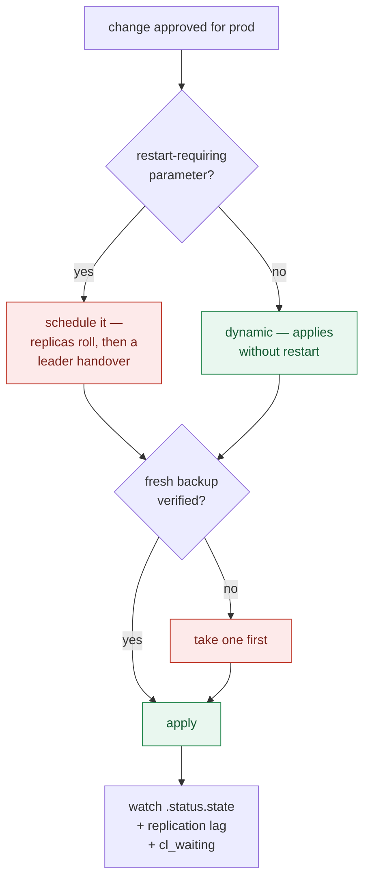

# CI/CD: promoting a database change from dev to prod

Application CD and database CD are not the same problem. An application rollback
is a pointer change; a database rollback may be a restore. This guide is about
the parts that differ.

The structure described here is in [`environments/`](../environments) and has
been built and deployed on the lab — `kubectl apply -k environments/dev` brings
up a cluster whose environment-specific overrides are verifiably in effect.

---

## The model: promote configuration, not images

<a id="promote-configuration-not-images"></a>

Notice what [`environments/base/cluster.yaml`](../environments/base/cluster.yaml)
pins and what the overlays do *not* override:

```yaml
image: docker.io/percona/percona-distribution-postgresql:18.3-2
```

No environment overrides it. Every environment runs the same PostgreSQL,
PgBouncer and pgBackRest builds, so "promotion" moves **configuration that has
already been exercised** rather than a freshly-built artifact.

This is the opposite of the usual application pipeline, and deliberately so. You
do not want prod to be the first environment where a given PostgreSQL binary
meets your data. Version bumps are their own change, made in the base, and they
roll through dev and staging like anything else.



---

## Environment layout

```
environments/
├── base/          one definition of cluster shape
├── dev/           1 instance, synchronous_commit off
├── staging/       prod's SHAPE at smaller capacity
└── prod/          full size + off-cluster backup repo
```

The rule worth enforcing in review: **staging differs from prod in capacity,
never in shape.** Staging runs three instances with synchronous replication on
small nodes, because a failover that only ever happens in production is not a
tested failover. Dev is allowed to differ in shape — it is a single instance
with `synchronous_commit: off` — because its job is to be fast and disposable.

| | dev | staging | prod |
|---|---|---|---|
| PostgreSQL instances | 1 | 3 | 3 |
| Synchronous replication | — | yes | yes |
| PgBouncer replicas | 1 | 2 | 3 |
| `shared_buffers` | 256MB | 256MB | 4GB |
| Storage | 2Gi | 2Gi | 500Gi |
| Backup repos | repo1 (PVC) | repo1 (PVC) | repo1 + **repo2 (S3)** |
| Full backup | weekly | weekly + daily diff | weekly + 4-hourly incr |
| Applied by CI | automatically | automatically | **never** |

<a id="why-json6902"></a>

## Why JSON6902 patches, not strategic merge

Every overlay uses `op:`-style patches. This is not stylistic.

`instances`, `repos` and `users` are **lists**. Kustomize has no merge-key
metadata for a custom resource, so a strategic-merge patch **replaces the whole
list**:

```yaml
# WRONG — this does not "just change replicas"
patches:
  - patch: |-
      spec:
        instances:
          - name: instance1
            replicas: 3
```

That silently discards `affinity`, `resources` and `dataVolumeClaimSpec` from
the base. The cluster comes up with default scheduling and no resource limits,
and nothing tells you.

```yaml
# RIGHT — targets one path, leaves the rest of the list intact
- op: replace
  path: /spec/instances/0/replicas
  value: 3
```

Verified on the rendered prod overlay: `instances[0]` still carries
`affinity`, `dataVolumeClaimSpec` and `resources` from the base, and
`backups.pgbackrest.repos` contains **both** `repo1` and `repo2` — because
appending with `/-` adds a repository rather than replacing the list:

```yaml
- op: add
  path: /spec/backups/pgbackrest/repos/-
  value:
    name: repo2
    s3: {...}
```

A strategic merge there would have deleted your local backup repository while
appearing to add a remote one.

One more property worth having: `op: replace` on a path that does not exist is
an **error**. A typo fails the pipeline instead of quietly adding a key nobody
reviewed. That is why the base declares `synchronous_commit` even though every
environment overrides it.

---

## The pipeline

### 1. Validate — on every pull request

Cheap, no cluster required, catches most of what goes wrong:

```bash
for env in dev staging prod; do
  kubectl kustomize environments/$env | kubeconform -strict -ignore-missing-schemas -
done
```

Add the checks that are specific to *your* rules, because a schema validator
will not catch a bad idea. Worth enforcing:

- no `image:` override outside `base/`
- prod has ≥ 3 instances and `synchronous_mode: true`
- prod has an off-cluster repo (a PVC-only prod is a prod with no disaster recovery)
- every repo has a matching `*-retention-full` (without it pgBackRest never
  expires anything and the volume fills silently)
- no `synchronous_commit: off` outside dev

### 2. Apply to dev — automatically

Merging to the main branch applies `environments/dev`. This is safe precisely
because dev is defined as disposable.

### 3. Test against the real cluster

This is the step most database pipelines skip, and it is the one that has value.
`kubectl apply` succeeding means the API server accepted your YAML — nothing
more. The operator may still be unable to reconcile it.

This repository's suite is the model: assert on *behaviour*, not on the manifest
you just applied.

```bash
scripts/run-tests.sh 00_operator.bats 20_ha.bats 40_pgbouncer.bats
```

The failure that motivates this: a duplicate `topologySpreadConstraint` is valid
YAML, is accepted by the API server, and then leaves the cluster at
`state: initializing` with **zero pods and zero events** — visible only in the
operator log. A pipeline that checks `kubectl apply` exit codes reports success.
See [11-troubleshooting](11-troubleshooting.md#duplicate-topologyspreadconstraints-stop-reconciliation-dead).

Gate on cluster state, not on `apply`:

```bash
kubectl -n app-dev wait --for=jsonpath='{.status.state}'=ready \
  perconapgcluster/app-pg --timeout=15m
```

### 4. Staging — automatically, and let it soak

Same shape as prod. Run the failover test here, because this is the last chance
to discover that your synchronous configuration is not doing what you believe:

```bash
kubectl -n app-staging delete pod <primary> --force --grace-period=0
```

A plain `delete pod` will *not* do it — Patroni catches `SIGTERM` and performs a
graceful handover, which measures a switchover while looking like a crash test.
See [09-lifecycle-operations](09-lifecycle-operations.md#switchover-vs-failover).

### 5. Prod — with a human, and a fresh backup



Which branch you are on is a question you can ask the database rather than guess:

```sql
select name, setting, pending_restart from pg_settings where pending_restart;
```

`shared_buffers`, `max_connections`, `max_worker_processes` and
`max_wal_senders` all require a restart. The operator rolls replicas first and
the primary last, so the write interruption is one leader handover — not zero.
Batch such changes rather than trickling them out.

---

## GitOps

The layout works unchanged with Argo CD or Flux. An `ApplicationSet` over
`environments/*` is the obvious shape — with one important exception:

```yaml
syncPolicy:
  automated:
    prune: false        # never let a controller delete a database
    selfHeal: true
```

**Do not enable `prune` on database resources.** Pruning is correct for
stateless workloads and catastrophic here: a bad selector, a moved file, a
rename, and the controller deletes the `PerconaPGCluster`.

The operator does not garbage-collect PVCs when a cluster is deleted — that is
deliberate, and it is the thing that saves you. But it is a last line of
defence, not a plan.

Prod's `Application` should be `syncPolicy: {}` — manual sync only.

---

## Secrets

Nothing in `environments/` contains a credential, and the S3 repository refers
to a Secret by name:

```yaml
configuration:
  - secret:
      name: app-pg-pgbackrest-s3
```

Create it out-of-band with External Secrets Operator, Sealed Secrets, or your
cloud's secret manager. Two operator-specific notes:

- **User passwords are generated, not supplied.** The operator creates
  `<cluster>-pguser-<user>`. Do not manage those Secrets in Git — you would be
  fighting the operator for ownership.
- **`password.type: AlphaNumeric` matters** for any user whose password ends up
  in a URL. The `ASCII` default generates `@ [ ] / ?`, which are structural in a
  `postgres://` DSN. See
  [11-troubleshooting](11-troubleshooting.md#exporter-dsn-breaks-on-a-generated-password).

---

## What not to automate

Some operations are one-way doors. They belong in a runbook a human executes,
not in a pipeline.

| Operation | Why not |
|---|---|
| `PerconaPGRestore` | Destructive and in-place. The cluster is taken down and its data directory replaced. |
| Major version upgrade | `pg_upgrade` means downtime for the whole cluster, and it is not reversible. |
| DR promotion | One-way. The promoted cluster forks a timeline and cannot replay from the old repository again — and if it keeps the source `repo2-path` it corrupts that repository for every future standby. |
| Deleting a cluster | Obvious, but worth an explicit deny rule rather than trusting review. |
| Scaling *down* PostgreSQL | Removes the highest-ordinal instances. Recoverable, since PVCs survive, but not something to discover from a diff. |

The general test: **if getting it wrong requires a restore, a human runs it.**

---

## Trying the pipeline on this lab

```bash
kubectl kustomize environments/dev      # inspect the rendered manifest
kubectl create ns app-dev
kubectl apply -k environments/dev
kubectl -n app-dev wait --for=jsonpath='{.status.state}'=ready pg/app-pg --timeout=15m
```

Verified on the lab: ready in 30 seconds, `1/1` PostgreSQL and `1/1` PgBouncer,
and the dev override in effect —

```
$ psql -c 'show synchronous_commit'
 off
```

`staging` and `prod` render correctly but are sized for real hardware; applying
`prod` to a laptop will leave pods `Pending` on the 500Gi volume request. That
is the correct behaviour, and a useful thing to see once.
