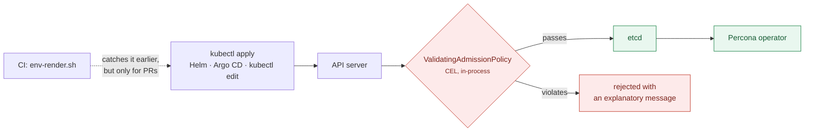

# Admission policies: enforcing the rules at the API server

[`scripts/env-render.sh`](../scripts/env-render.sh) checks the promotion rules in
CI. That is advice — it only sees manifests that arrive through a pull request.
This page is about enforcement: the same rules as
[`ValidatingAdmissionPolicy`](https://kubernetes.io/docs/reference/access-authn-authz/validating-admission-policy/),
evaluated by the API server on every write, whatever the source.

```bash
make policy-check      # report what WOULD be rejected — changes nothing
make policy-install
make policy-test       # 17 assertions
```

Requires Kubernetes 1.30+ (GA in `admissionregistration.k8s.io/v1`). No webhook,
no controller, no certificate to rotate — CEL evaluated in-process by the API
server.



Both layers earn their place. CI gives a fast, reviewable failure on a pull
request. Admission catches the manifest that reaches the API server some other
way — a `kubectl edit` during an incident, a Helm chart from elsewhere, a GitOps
controller syncing a branch nobody reviewed.

---

## Why these rules

The baseline policy is not a style guide. **Every rule encodes a failure this
lab actually hit, chosen because the operator does not tell you when you get it
wrong.** It accepts the resource and then misbehaves quietly. That is exactly
the situation admission control exists for — without it, the feedback loop is
"the cluster is broken and nothing says why".

| Rule | What happens without it |
|---|---|
| No duplicate `topologySpreadConstraint` | Reconciliation stops dead. **Zero pods, zero events**, cluster stuck at `initializing`. The only trace is one line in the operator log. |
| Retention on every backup repo | pgBackRest never expires anything. The volume fills weeks later, long after anyone connects it to this manifest. |
| `auth_dbname` whenever `admin_users` is set | The PgBouncer admin console rejects every connection with `bouncer config error`, so `SHOW POOLS` and `pgbouncer_exporter` never work. |
| No user named `monitor` | Reserved. The operator logs one INFO line, never creates the Secret, and anything referencing it wedges in `CreateContainerConfigError`. |
| At most one preload-requiring extension | The operator preloads exactly one library. The others are created and then fail every query with `must be loaded via shared_preload_libraries`. |
| No hand-set `shared_preload_libraries` | Operator-managed. Your value is appended to and then overwritten on the next reconcile. |

Each is explained in full in [11-troubleshooting](11-troubleshooting.md). The
policy exists so nobody has to read that page first.

The production policy is the environment contract from
[14-cicd-promotion](14-cicd-promotion.md): at least three instances,
`synchronous_mode`, an off-cluster backup repository, explicit resource limits,
`required` anti-affinity, no `synchronous_commit: off`, no `spec.pause`.

---

## Scoping: bind by label, not by name

```yaml
matchResources:
  namespaceSelector:
    matchLabels:
      percona-pg-lab.io/environment: prod
```

Production rules apply to any namespace labelled as production. A new prod
namespace inherits them by being labelled correctly, rather than by someone
remembering to add it to a list. `make policy-install` labels the lab's
`app-dev`, `app-staging` and `app-prod` namespaces accordingly.

`tests/95_admission_policy.bats` asserts the selector works in **both**
directions — a one-instance cluster is rejected in a prod-labelled namespace and
accepted in an unlabelled one. A selector that accidentally matches everything
would pass a naive test while making dev unusable.

---

## Deny, not Warn

Both bindings use `validationActions: [Deny]`.

`Warn` returns the message as a warning header and admits the object anyway.
For rules whose failure mode is *silence*, that is the wrong choice — a warning
printed during `kubectl apply` is exactly the signal people scroll past. If the
rule is worth having, it is worth failing on; if it is not, delete it.

`Audit` is genuinely useful for a **rollout**: log violations for a week, see
what you would have broken, then switch to `Deny`. `make policy-check` does the
same thing without installing anything, by server-dry-running every existing
cluster against the policies:

```
$ make policy-check
  ✓ app-dev/app-pg
  ✓ pg-ha/ha-cluster
  ✓ every existing cluster satisfies the policies
```

Run that before installing anywhere that already has clusters. Verified on this
lab: all four shipped profiles and all three environment overlays pass, and
`environments/prod` satisfies the production policy in a prod-labelled namespace.

---

## Writing CEL against a CRD

Two things cost me time here, both worth knowing before you extend these.

### `x-kubernetes-preserve-unknown-fields` defeats the type checker

`spec.patroni.dynamicConfiguration` accepts arbitrary Patroni keys, so the CRD
marks it `x-kubernetes-preserve-unknown-fields`. CEL's type checker cannot see
inside it:

```
ERROR: undefined field 'postgresql'
```

The expression still **works at runtime** — but it emits a type-check warning,
and a warning is precisely the thing that gets ignored until the rule silently
does nothing. Route the access through a `variables` entry instead, which is
type-checked differently:

```yaml
variables:
  - name: pgParams
    expression: >-
      has(object.spec.patroni) && has(object.spec.patroni.dynamicConfiguration)
        && has(object.spec.patroni.dynamicConfiguration.postgresql)
        && has(object.spec.patroni.dynamicConfiguration.postgresql.parameters)
        ? object.spec.patroni.dynamicConfiguration.postgresql.parameters : {}
validations:
  - expression: "!('shared_preload_libraries' in variables.pgParams)"
```

Same behaviour, no warning. `tests/95_admission_policy.bats` **fails the build
on any type-check warning**, so this cannot regress unnoticed:

```bash
kubectl get validatingadmissionpolicy percona-pg-baseline \
  -o jsonpath='{.status.typeChecking.expressionWarnings[*].fieldRef}'
```

### Guard every optional field

`has()` on a missing parent is an error, not `false`. Chain the guards, or
default through a variable as above. Almost everything in a `PerconaPGCluster`
is optional.

---

## Testing policies

A policy that denies everything passes a naive "did it reject?" test while
making the cluster unusable. Every suite here therefore asserts **both**
directions, and each fixture in [`policy/testdata/`](../policy/testdata) violates
exactly **one** rule.

That second point is not fussiness. The first version of these fixtures derived
the production cases from a dev manifest, so they each violated *two* rules — the
one under test plus the missing off-cluster repo. The tests failed while the
policy was working correctly, and the failure message pointed at the wrong rule.

```bash
make policy-test
```

```
✓ a valid cluster is admitted
✓ rejects a topologySpreadConstraint that duplicates the operator's
✓ production rules do NOT apply to an unlabelled namespace
✓ production rejects fewer than three instances
... 17 assertions
```

---

## Adding a rule

1. Add the fixture to `policy/testdata/`, violating **only** the new rule.
2. Add the validation with a `message` that says what to do, not just what is
   wrong. The person reading it is mid-`kubectl apply` and does not have this
   page open.
3. Add both assertions to `tests/95_admission_policy.bats`: the violation is
   rejected, and a valid manifest still is not.
4. `make policy-check` against a cluster with real workloads before shipping it.

The bar worth holding: **a rule belongs here if getting it wrong fails
silently.** Anything the operator already reports clearly is better left to the
operator — an admission rule that duplicates a good error message is just
another thing to maintain.

---

## Limits

- **Nothing is enforced retroactively.** Existing clusters are only re-validated
  on their next write. `make policy-check` is how you find them.
- **`failurePolicy: Fail`** means a broken policy blocks writes to
  `PerconaPGCluster`. That is the right default for a rule you care about, but
  know that it is the trade you made.
- **The operator is exempt in practice** — it writes `PostgresCluster` (the
  upstream kind), not `PerconaPGCluster`, so these policies constrain what
  *humans and pipelines* submit, which is what you want.
- **These do not replace RBAC.** They constrain the shape of what you may
  create, not whether you may create it.
