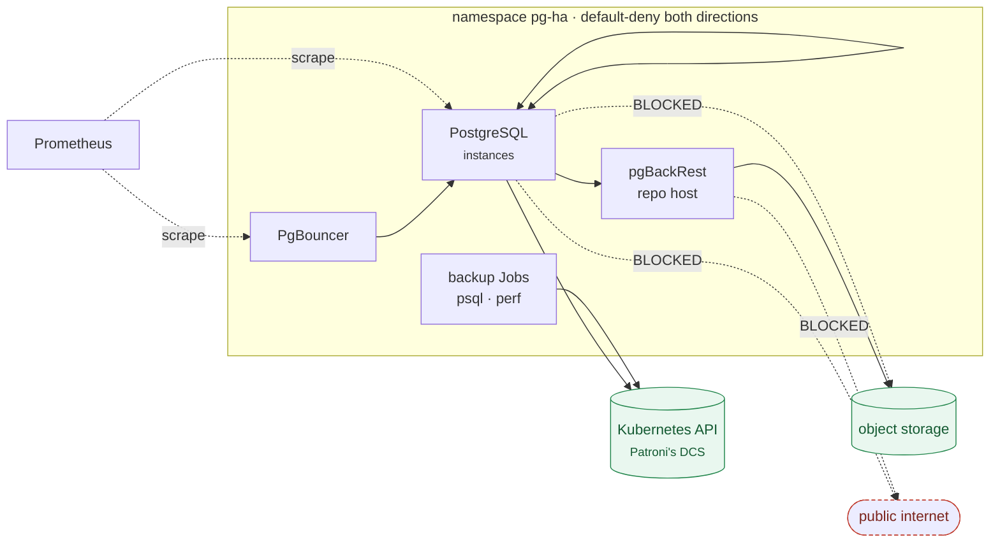

# Network policy and the rest of the security posture

You asked whether PostgreSQL should be barred from making outbound calls. The
short answer is **yes, but not literally** — and the gap between those is the
interesting part.

```bash
make netpol-install     # default-deny + a verified allowlist
make netpol-test        # 12 assertions: required flows work, nothing else does
```

---

## PostgreSQL under this operator is not a closed box

A naive "deny all egress from the database pods" takes the cluster down, because
**Patroni uses the Kubernetes API as its distributed configuration store.**
Verified on this lab — `/etc/patroni/~postgres-operator_cluster.yaml` contains:

```yaml
kubernetes:
  namespace: pg-ha
  use_endpoints: true
```

Not etcd, not Consul. The API server *is* the DCS. Cut that path and Patroni
cannot renew the leader lease: the cluster demotes itself and goes read-only.
It does not crash, and the symptom looks like a database problem rather than a
network one.

So the goal is not "no egress". It is **no egress except a short, enumerated
list** — which is achievable, and which this lab verifies:



Note what that buys you beyond "no internet": **PostgreSQL cannot reach object
storage either.** Only the repo host can. A compromised PostgreSQL process
cannot exfiltrate to the backup bucket even though the bucket is reachable from
the namespace. Scoping egress per role rather than per namespace is most of the
value here.

### Verified on the running cluster

| From | To | Result |
|---|---|---|
| PostgreSQL | peer instances `:5432` | **OPEN** |
| PostgreSQL | repo host `:8432` | **OPEN** |
| PostgreSQL | Kubernetes API `:6443` | **OPEN** — Patroni's DCS |
| PostgreSQL | object storage `:9000` | **BLOCKED** |
| PostgreSQL | `1.1.1.1:443` | **BLOCKED** |
| repo host | object storage `:9000` | **OPEN** |
| repo host | `1.1.1.1:443` | **BLOCKED** |
| unlabelled namespace | pgBouncer `:5432` | **BLOCKED** |

And functionally: cluster stays `ready` 3/3, replication streams, a backup
completes end to end.

---

## Check your CNI enforces NetworkPolicy at all

The `NetworkPolicy` API exists on **every** cluster, because it is part of core
Kubernetes. Whether anything *enforces* it is a property of the CNI, and several
common ones do not. Creating policies against a CNI that ignores them is worse
than creating none — you believe you are isolated and you are not.

`scripts/netpol-install.sh` refuses to proceed without proving enforcement
first: it creates a throwaway namespace, applies deny-all, and checks that a pod
in it genuinely cannot reach the API server.

```
==> verifying the CNI enforces NetworkPolicy
  ✓ NetworkPolicy is enforced by this CNI
```

kind's default `kindnet` **does** enforce it on the version this lab runs
(Kubernetes 1.37) — which surprised me, since it historically did not. That is
exactly why the check is empirical rather than a version comparison.

---

## Two things that will bite you

### The API server has two addresses

The first version of these policies allowed the API server's *endpoint*
(`172.18.0.6:6443`) and PostgreSQL was fine — while the operator's backup Jobs
failed for twenty minutes with:

```
dial tcp 10.96.0.1:443: i/o timeout
```

In-cluster clients resolve `kubernetes.default.svc` to the **Service ClusterIP**
(`10.96.0.1:443`), and whether a NetworkPolicy matches the pre- or post-DNAT
address depends on the CNI. Allow both:

```yaml
- to: [{ipBlock: {cidr: 172.18.0.6/32}}]   # endpoint
  ports: [{protocol: TCP, port: 6443}]
- to: [{ipBlock: {cidr: 10.96.0.1/32}}]    # Service ClusterIP
  ports: [{protocol: TCP, port: 443}]
```

The install script discovers and substitutes both.

### Transient pods are easy to forget

The operator's backup and restore Jobs are not instances, poolers or repo hosts
— they match none of the role selectors, so under default-deny they get DNS and
nothing else. The cluster looks perfectly healthy while the namespace fills with
`Error` pods.

`policy/netpol/50-cluster-jobs.yaml` selects by the **absence** of the operator's
labels, so a new kind of ancillary pod is covered automatically:

```yaml
podSelector:
  matchExpressions:
    - {key: postgres-operator.crunchydata.com/data, operator: DoesNotExist}
    - {key: postgres-operator.crunchydata.com/role, operator: DoesNotExist}
```

### NetworkPolicy needs both sides, every time

The client pod could reach pgBouncer but not PostgreSQL directly, and the
symptom was a connection timeout that looks exactly like a database outage.

The egress rule was there — ancillary pods were allowed to send to
`data=postgres` on 5432. What was missing was the corresponding **ingress** rule
on the PostgreSQL pods, whose `from` list named only pgBouncer and peer
instances. Both sides must permit a flow; allowing one is the same as allowing
neither, minus the clue.

Worth knowing while debugging this: `<cluster>-primary` is a **headless**
Service whose endpoint is not a pod IP. Patroni runs with
`use_endpoints: true` and points it at the `<cluster>-ha` ClusterIP:

```
$ kubectl get svc ha-cluster-primary
NAME                 TYPE        CLUSTER-IP
ha-cluster-primary   ClusterIP   None

$ kubectl get endpoints ha-cluster-primary
10.96.1.125          # <- this is ha-cluster-ha's ClusterIP, not a pod
```

So a "direct" connection is DNS → headless Service → ClusterIP → kube-proxy →
pod. It still terminates at a `data=postgres` pod, which is what the podSelector
matches — but if you are staring at packet captures wondering why the address
does not look like a pod, that is why.

### Order of application

Allow rules **first**, `default-deny` **last**. Reversed, on a live cluster,
there is a window where traffic is denied and nothing permits it again — long
enough for Patroni to lose its lease and fail over while you are still typing.
`netpol-install.sh` applies them in that order; `netpol-uninstall.sh` removes
`default-deny` first, for the same reason.

---

## Pod Security Standards

Also worth having, and cheaper than expected:

```bash
kubectl label ns pg-ha \
  pod-security.kubernetes.io/enforce=restricted \
  pod-security.kubernetes.io/enforce-version=latest
```

**The operator's own containers already satisfy `restricted`.** Verified:

| Container | | |
|---|---|---|
| `database`, `pgbackrest`, `replication-cert-copy`, `pgbackrest-config` | `runAsNonRoot: true`, `allowPrivilegeEscalation: false` | `readOnlyRootFilesystem: true`, `capabilities: drop [ALL]`, `seccompProfile: RuntimeDefault` |

A pgBouncer pod deleted under enforcement was recreated cleanly, 3/3 running.

**The violations were mine.** Two of them, and both worth admitting because they
are the ones you will hit too:

1. **My exporter sidecars had no `seccompProfile`.** The operator sets it on its
   own containers; a sidecar you add is yours to harden — and without it the
   whole *pod* fails admission under `restricted`, taking the database with it,
   not just the sidecar.
2. **The lab's own tooling used plain `kubectl run`**, which `restricted`
   rejects outright. `make test`, `make perf` and `scripts/connect.sh` now set a
   compliant `securityContext`. It would be an odd repository whose test harness
   was the reason you could not enable Pod Security.

`make policy-install` applies the `restricted` label to the lab's namespaces.
Set `PSS=0` to skip it.

### A kubectl trap worth knowing

Adding a `securityContext` via `kubectl run --overrides` looked simple and was
not:

```bash
# WRONG — silently discards the generated command and env
kubectl run x --overrides='{"spec":{"containers":[{"name":"x", ...}]}}'

# RIGHT
kubectl run x --override-type=strategic --overrides='...'
```

`--overrides` defaults to a **JSON merge patch**, which replaces the containers
list wholesale. The pod starts as a bare PostgreSQL image and fails with
"Database is uninitialized" — an error that tells you nothing about the actual
cause. `strategic` merges by container name.

This is the same list-replacement trap as a strategic-merge patch on a custom
resource, described in
[14-cicd-promotion](14-cicd-promotion.md#why-json6902). It recurs.

---

## Other layers worth having

Ordered by value for effort, given everything above is in place.

| Layer | Why | Status here |
|---|---|---|
| **Admission policies** | The operator accepts several misconfigurations silently | Implemented — [15-admission-policies](15-admission-policies.md) |
| **NetworkPolicy** | Blast radius, and blocking exfiltration paths | Implemented, verified |
| **Pod Security `restricted`** | Constrains every pod the operator creates | Implemented, verified |
| **Sidecar hardening at admission** | Sidecars are arbitrary containers in the CR | Implemented — 6 assertions |
| **RBAC on the CR** | "Who can edit a PerconaPGCluster" is close to "who can run a pod next to the database". Scope `pgv2.percona.com` verbs narrowly, and remember that `spec.users[].options` accepts `SUPERUSER`. | Not implemented — cluster-specific |
| **TLS** | The operator issues internal certificates automatically. `spec.tlsOnly: true` refuses non-TLS connections; `spec.customTLSSecret` uses your own CA. | Not implemented |
| **Secrets at rest** | The operator generates user Secrets. Encryption at rest and a real secret store are cluster concerns, not CR ones. | Not implemented |
| **Audit logging** | `pgaudit` for in-database DDL/DML auditing — but note it competes for the single `shared_preload_libraries` slot, so it is a trade against query statistics. See [08-extensions](08-extensions.md#only-one-preload-extension-at-a-time). | Documented |
| **Image provenance** | Pin by digest rather than tag; verify signatures with a policy controller. | Tags pinned, digests not |

The honest ordering: admission policies and Pod Security give the most safety
per line of configuration, because they are declarative, cheap to test, and
constrain things the operator will otherwise accept. NetworkPolicy is more work
and easier to get subtly wrong — as this page's two war stories show — but it is
the only layer that limits what a *compromised* database can reach.

---

## What this does not protect against

Worth stating, because a security page that only lists wins is a marketing page.

- **A compromised repo host can still reach object storage**, because it must.
  That is where your backups are.
- **NetworkPolicy is layer 3/4.** It permits `postgres → repo-host:8432`; it
  cannot tell a legitimate pgBackRest call from anything else on that port.
- **`spec.users[].options` accepts `SUPERUSER`.** Anyone who can edit the CR can
  grant it. That is an RBAC problem, not a network one, and none of the policies
  here address it.
- **The operator itself runs cluster-wide in this lab.** Its ServiceAccount can
  read Secrets in every namespace it watches. `watchAllNamespaces: false` is the
  smaller blast radius if you do not need the reach —
  [01-architecture](01-architecture.md#operator-scope).
